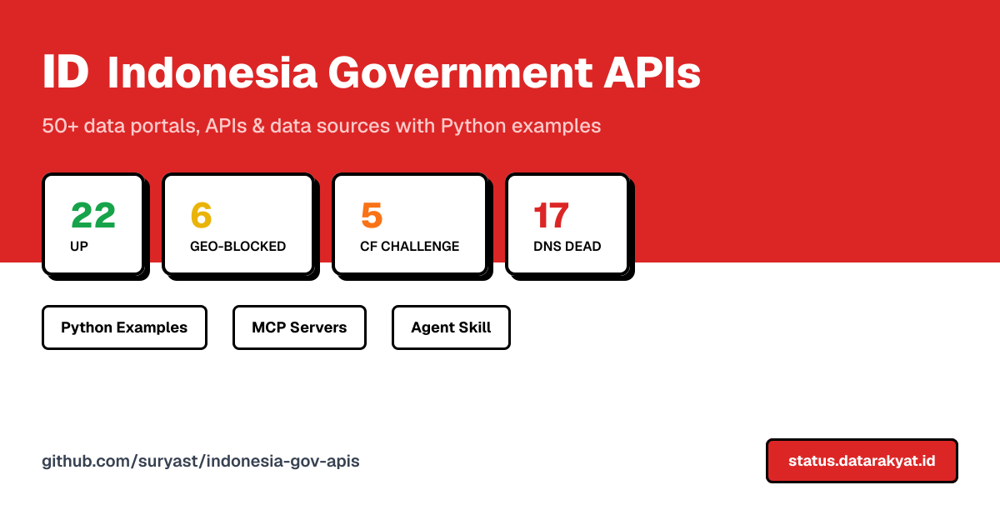

# 🇮🇩 Indonesia Government APIs & Data Sources



**59 documented source records: 58 Indonesia-related records and 1 international reference.** Includes government and non-government publishers, overlapping services and historical endpoints — not 59 verified open APIs. **11 supplementary guides** are counted separately.

<!-- catalog:source_documents=59 -->
<!-- catalog:indonesia_source_documents=58 -->
<!-- catalog:international_reference_documents=1 -->
<!-- catalog:supplementary_documents=11 -->

The [machine-readable catalog](catalog/sources.json) is the source inventory. Every entry records publisher, tier, documentation, portal URL, government/non-government classification, access notes, review state and dated evidence. [Review findings and primary sources](docs/source-review-2026-10-10.md) distinguish documentation confirmation, bounded endpoint observations and unverified history.

## What changed in the October 10, 2026 review

- Filled all five previously undocumented tier-8 additions; included BAPPEBTI and Japan NTA explicitly. Tier 7 now contains seven records, including the preserved Aturan.org contribution.
- Withdrawn the BPJPH supervisor-as-certified-business example and totals. SIKePO is banking-regulation search, not a fintech/crypto registry; see the cited source docs.
- Removed blanket CKAN/API-works claims, speculative quotas and access-control bypass advice. Historical notes are marked superseded, not presented as current integrations.
- Public pages, account-gated tax/health systems and third-party indexes are explicitly different access classes. No credentials, personal-record queries or authenticated production integrations were used in this review.
- [Issue #1](https://github.com/suryast/indonesia-gov-apis/issues/1) and [PR #9](https://github.com/suryast/indonesia-gov-apis/pull/9) were reviewed read-only. PR #9 subsequently merged on October 10, 2026 (`21cfe4b`); its Aturan.org source is preserved with documentation-only authentication/provenance caveats, not historical availability badges.

## Monitoring is a separate inventory

The [static status page](https://status.datarakyat.id), [latest observation](status/data/latest.json) and [monitor guide](status/README.md) describe HTTP/transport observations, not API usability, licensing or record correctness. Catalog `monitor_ids` may map multiple endpoint probes to one source document. An empty array means unmonitored: **BAPPEBTI, NTA, OGP Indonesia and Aturan.org**. The preserved PR #10 expansion brings monitoring to **75 endpoints**: 57 mapped to source documents and [18 monitoring-only entries](docs/monitor-only-endpoints.md), also recorded in [their separate registry](catalog/monitor-only.json). These added probes do not inflate the 59-source documentation count. Monitor totals are validated against `status/check.py`, not inferred from documentation totals. Content markers are limited heuristics, not API/schema certification.

An absent regional observation is unknown, not evidence of a geo-block. One 403 or timeout does not prove nationwide or foreign-IP restrictions. Retained [March 29, 2026 status notes](status/2026-03-29-update.md) are historical and internally inconsistent; do not reuse their totals or global availability claims as current evidence.

## Link-status audit

The [Markdown link audit](docs/link-audit-2026-10-10.md) and
[machine-readable audit snapshot](docs/link-audit-2026-10-10.json) record bounded,
dated URL observations. They do not validate API schemas, authentication, data
correctness or reuse permissions. Unreachable/blocked links remain explicitly
unverified; an HTTP 200 landing page is not a working API.

## Source index

Tier names are retained for navigation compatibility, not graded promises of availability. **Unverified** means inventory/document review only. **Primary documentation reviewed** confirms only the stated publisher documentation; **endpoint observed** is scoped to the recorded request, not all interfaces.

### Tier 1 — historically open-API candidates (12 records)

| Source / documentation | Publisher | Kind | Review state |
|---|---|---|---|
| [Portal APBN Kemenkeu — State Budget Data](apis/tier1-open-apis/apbn-kemenkeu/README.md) | Kementerian Keuangan (Ministry of Finance) | government | unverified |
| [Bank Indonesia — Central Bank Data](apis/tier1-open-apis/bank-indonesia/README.md) | Bank Indonesia (BI) | government | unverified |
| [BIG Geospatial / INA-SDI — National Geospatial Data](apis/tier1-open-apis/big-geospatial/README.md) | Badan Informasi Geospasial (Geospatial Information Agency) | government | unverified |
| [BMKG — Meteorology, Climatology & Geophysics Data](apis/tier1-open-apis/bmkg/README.md) | Badan Meteorologi, Klimatologi, dan Geofisika | government | primary documentation reviewed |
| [BNPB — Disaster Data & Risk Portal](apis/tier1-open-apis/bnpb-disaster/README.md) | Badan Nasional Penanggulangan Bencana (National Disaster Management Agency) | government | endpoint observed |
| [BPS — Statistics Indonesia](apis/tier1-open-apis/bps/README.md) | Badan Pusat Statistik (Central Bureau of Statistics) | government | primary documentation reviewed |
| [data.go.id — National Open Data Portal](apis/tier1-open-apis/data-go-id/README.md) | Satu Data Indonesia (One Data Indonesia) | government | unverified |
| [DJPB Treasury — State Treasury & Budget Disbursement](apis/tier1-open-apis/djpb-treasury/README.md) | Direktorat Jenderal Perbendaharaan (DJPB), Kementerian Keuangan | government | unverified |
| [IDX — Indonesia Stock Exchange](apis/tier1-open-apis/idx/README.md) | Bursa Efek Indonesia (Indonesia Stock Exchange) | non-government | unverified |
| [JDIH BPK — National Legal Documentation Network](apis/tier1-open-apis/jdih-bpk/README.md) | Badan Pemeriksa Keuangan | government | unverified |
| [LPSE / INAPROC — Government Procurement Data](apis/tier1-open-apis/lpse-inaproc/README.md) | LKPP (National Procurement Policy Agency) | government | unverified |
| [Putusan Mahkamah Agung — Supreme Court Decisions](apis/tier1-open-apis/putusan-ma/README.md) | Mahkamah Agung RI (Supreme Court of Indonesia) | government | unverified |

### Tier 2 — public web/search candidates (10 records)

| Source / documentation | Publisher | Kind | Review state |
|---|---|---|---|
| [AHU Online — Company Registry](apis/tier2-scrapeable/ahu-company/README.md) | Ditjen AHU | government | unverified |
| [BPJPH — Halal Certification Database](apis/tier2-scrapeable/bpjph/README.md) | Badan Penyelenggara Jaminan Produk Halal | government | primary documentation reviewed |
| [BPOM — Food, Drug & Cosmetics Registry](apis/tier2-scrapeable/bpom/README.md) | Badan Pengawas Obat dan Makanan (National Agency of Drug and Food Control) | government | unverified |
| [KPK e-LHKPN — Public Officials Wealth Declarations](apis/tier2-scrapeable/kpk-lhkpn/README.md) | Komisi Pemberantasan Korupsi (Corruption Eradication Commission) | government | primary documentation reviewed |
| [KSEI — Securities Ownership & Investor Statistics](apis/tier2-scrapeable/ksei/README.md) | Kustodian Sentral Efek Indonesia (Indonesian Central Securities Depository) | non-government | unverified |
| [OJK — Financial Entity Legality Check](apis/tier2-scrapeable/ojk/README.md) | Otoritas Jasa Keuangan (Financial Services Authority) | government | primary documentation reviewed |
| [OSS / NIB — Business Identification Number Lookup](apis/tier2-scrapeable/oss-nib/README.md) | BKPM / OSS (Online Single Submission) | government | unverified |
| [Pajak.go.id / DJP — Tax Authority Data](apis/tier2-scrapeable/pajak-djp/README.md) | Direktorat Jenderal Pajak (DGT — Directorate General of Taxes) | government | primary documentation reviewed |
| [e-PPID — Public Information Request Portal](apis/tier2-scrapeable/ppid/README.md) | All ministries and agencies (Kemkominfo coordination) | government | unverified |
| [Putusan Mahkamah Konstitusi — Constitutional Court Decisions](apis/tier2-scrapeable/putusan-mk/README.md) | Mahkamah Konstitusi RI (Constitutional Court of Indonesia) | government | unverified |

### Tier 3 — regional data portals (6 records)

| Source / documentation | Publisher | Kind | Review state |
|---|---|---|---|
| [Open Data Bali — Bali Provincial Open Data](apis/tier3-regional/opendata-bali/README.md) | Pemerintah Provinsi Bali | government | unverified |
| [Open Data Kota Bandung — Bandung City Open Data](apis/tier3-regional/opendata-bandung/README.md) | Pemerintah Kota Bandung | government | unverified |
| [Open Data Jabar — Jawa Barat Provincial Open Data](apis/tier3-regional/opendata-jabar/README.md) | Pemerintah Provinsi Jawa Barat | government | unverified |
| [Open Data Jawa Timur — East Java Provincial Open Data](apis/tier3-regional/opendata-jatim/README.md) | Pemerintah Provinsi Jawa Timur | government | unverified |
| [Satu Data Jakarta — DKI Jakarta Open Data](apis/tier3-regional/satu-data-jakarta/README.md) | Pemerintah Provinsi DKI Jakarta | government | unverified |
| [Satu Data Surabaya — Surabaya City Open Data](apis/tier3-regional/satu-data-surabaya/README.md) | Pemerintah Kota Surabaya | government | unverified |

### Tier 4 — ministry-specific references (8 records)

| Source / documentation | Publisher | Kind | Review state |
|---|---|---|---|
| [ATR/BPN — Land & Property Registry](apis/tier4-ministry/atr-bpn/README.md) | Kementerian ATR / Badan Pertanahan Nasional | government | unverified |
| [ESDM — Energy & Mining Data](apis/tier4-ministry/esdm-energy/README.md) | Kementerian Energi dan Sumber Daya Mineral | government | unverified |
| [Kemenag — Religious Affairs Data](apis/tier4-ministry/kemenag/README.md) | Kementerian Agama | government | unverified |
| [Kemendikdasmen — Education Data](apis/tier4-ministry/kemendikdasmen/README.md) | Kementerian Pendidikan Dasar dan Menengah | government | unverified |
| [Kemenkes — Health Data & Facility Registry](apis/tier4-ministry/kemenkes/README.md) | Kementerian Kesehatan | government | primary documentation reviewed |
| [Satu Data Kemnaker — Labor & Employment Data](apis/tier4-ministry/kemnaker/README.md) | Kementerian Ketenagakerjaan (Ministry of Manpower) | government | unverified |
| [KKP — Fisheries & Maritime Data](apis/tier4-ministry/kkp-fisheries/README.md) | Kementerian Kelautan dan Perikanan (Ministry of Marine Affairs and Fisheries) | government | unverified |
| [Satu Data Komdigi — Digital & Telecoms Data](apis/tier4-ministry/komdigi/README.md) | Kementerian Komunikasi dan Digital (Ministry of Digital Affairs) | government | unverified |

### Tier 5 — transparency references (5 records)

| Source / documentation | Publisher | Kind | Review state |
|---|---|---|---|
| [AHU-BO — Beneficial Ownership Registry](apis/tier5-transparency/ahu-bo/README.md) | Ditjen AHU | government | unverified |
| [EITI Indonesia — Extractives Transparency](apis/tier5-transparency/eiti-indonesia/README.md) | EITI / Kementerian ESDM | government | unverified |
| [ICW — Indonesia Corruption Watch](apis/tier5-transparency/icw-corruption/README.md) | ICW (NGO) | non-government | unverified |
| [OCCRP Aleph — Global Beneficial Ownership & Leaks](apis/tier5-transparency/occrp-aleph/README.md) | OCCRP (Organized Crime and Corruption Reporting Project) | non-government | unverified |
| [OpenCorporates — Global Company Registry](apis/tier5-transparency/opencorporates/README.md) | OpenCorporates Ltd | non-government | unverified |

### Tier 6 — financial references (4 records)

| Source / documentation | Publisher | Kind | Review state |
|---|---|---|---|
| [DJPB — Budget Execution Data](apis/tier6-financial/djpb-budget/README.md) | Direktorat Jenderal Perbendaharaan, Kementerian Keuangan | government | unverified |
| [KSEI — Securities Investor Statistics](apis/tier6-financial/ksei-stats/README.md) | Kustodian Sentral Efek Indonesia | non-government | unverified |
| [OJK SIKePO — Banking Regulations](apis/tier6-financial/ojk-sikepo/README.md) | OJK (Otoritas Jasa Keuangan) | government | primary documentation reviewed |
| [Satgas Waspada Investasi — Investment Fraud Alerts](apis/tier6-financial/satgas-waspada/README.md) | OJK / Multi-agency task force | government | unverified |

### Tier 7 — civic/legal/geospatial references (7 records)

| Source / documentation | Publisher | Kind | Review state |
|---|---|---|---|
| [Aturan.org — Indonesian Legal Retrieval REST API & MCP](apis/tier7-civil-society/aturan-org/README.md) | Aturan.org (third-party publisher) | non-government | primary documentation reviewed |
| [Indonesia Geoportal — One Map Policy](apis/tier7-civil-society/geoportal-onemap/README.md) | BIG / KLHK / Multiple | government | unverified |
| [IndoLII — Indonesian Legal Information (Bilingual)](apis/tier7-civil-society/indolii/README.md) | USAID / Various | non-government | unverified |
| [LAPOR — National Public Complaint System](apis/tier7-civil-society/lapor/README.md) | Kementerian PAN-RB (Ministry of Administrative Reform) | government | unverified |
| [OGP Indonesia — Open Government Partnership](apis/tier7-civil-society/ogp-indonesia/README.md) | Open Government Indonesia | government | unverified |
| [pasal.id — Indonesian Law & Regulation MCP Server](apis/tier7-civil-society/pasal-id/README.md) | Open source (community-maintained, third-party) | non-government | unverified |
| [SIGAP / InaRisk — Disaster Risk Assessment](apis/tier7-civil-society/sigap-inarisk/README.md) | BNPB (Badan Nasional Penanggulangan Bencana) | government | unverified |

### Tier 8 — formerly missing additions (5 records)

| Source / documentation | Publisher | Kind | Review state |
|---|---|---|---|
| [BPJPH CMS Backend — Historical Endpoint Reference](apis/tier8-new/cmsbl-halal/README.md) | BPJPH | government | primary documentation reviewed |
| [Coretax DJP — Tax Administration](apis/tier8-new/coretax/README.md) | Direktorat Jenderal Pajak | government | primary documentation reviewed |
| [KPU — Election Publications](apis/tier8-new/kpu/README.md) | Komisi Pemilihan Umum | government | primary documentation reviewed |
| [SATUSEHAT — Authorized Health Interoperability](apis/tier8-new/satusehat/README.md) | Kementerian Kesehatan | government | primary documentation reviewed |
| [SIMBG — Building Permit Applications](apis/tier8-new/simbg/README.md) | Kementerian Pekerjaan Umum | government | primary documentation reviewed |

### Additional Indonesia reference (unmonitored) (1 records)

| Source / documentation | Publisher | Kind | Review state |
|---|---|---|---|
| [BAPPEBTI — Commodities Futures; Historical Crypto References](apis/other/bappebti/README.md) | Badan Pengawas Perdagangan Berjangka Komoditi | government | primary documentation reviewed |

### International reference (unmonitored) (1 records)

| Source / documentation | Publisher | Kind | Review state |
|---|---|---|---|
| [NTA — Japan Invoice Registry (Reference)](apis/reference/nta/README.md) | National Tax Agency (Japan) — 国税庁 | government | unverified |

## Getting started safely

1. Read the selected source's reviewed guidance and evidence, not its historical examples first.
2. Prefer publisher documentation and licensed aggregate downloads. Obtain required credentials through official channels; never commit or print them.
3. Verify endpoint, HTTP status, content type and response shape with a bounded request. Tests here are offline and do not establish live availability.
4. Respect publisher limits and attribution. Stop at login, CAPTCHA, access denial or explicit restrictions; request approved access instead of routing around controls.
5. Treat certification, registration, sector licensing and negative alerts as separate evidence. No result is not proof of compliance or legality.

For BMKG's official forecast interface and BPS key/response handling, see [BMKG](apis/tier1-open-apis/bmkg/README.md) and [BPS](apis/tier1-open-apis/bps/README.md). The [examples](examples/) have independent safeguards and tests; consult their CLI help before running network requests.

## AI-agent and MCP references

[SKILL.md](SKILL.md) routes queries to canonical reviewed documentation. [MCP guide](mcp-servers/README.md) separates third-party transport candidates from verified integrations. Never infer `/tools/<name>` REST routes from MCP tool names or allow a remote service to receive private records merely because it is publicly reachable.

## Offline verification

```sh
python scripts/validate_catalog.py
python -m unittest discover -s tests -p 'test_catalog.py'
python scripts/check_repository.py
```

The catalog validator checks schema, exact source/reference coverage, computed totals, monitor mappings, README index coverage and local Markdown links/anchors. External URL checks are syntactic, not live liveness tests. See [contribution guidance](CONTRIBUTING.md) for the broader gates.

## Related projects

- [indonesia-civic-stack](https://github.com/suryast/indonesia-civic-stack): separate SDK/MCP project; integration coverage is not verified by this catalog.
- indonesia-civic-signal-monitor: separate civic monitoring project; public reference unavailable (HTTP 404 observed October 10, 2026).

## Disclaimer and license

Independent educational/research documentation, not affiliated with the listed publishers. Public visibility does not imply bulk-access permission, unrestricted reuse or permission to publish personal data. Verify source terms, original records and applicable requirements. MIT applies to repository content, not automatically to external datasets.
